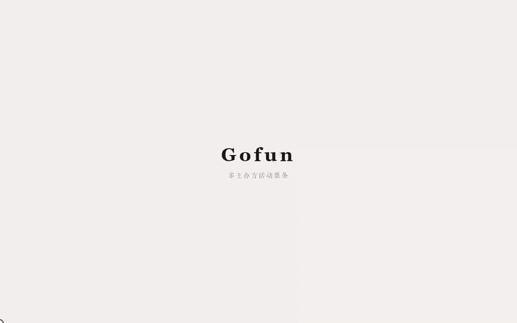

# Gofun

多主办方活动票务平台：发现活动、限时开售、门票制 / 选座制购票；主办方看销售和转化，平台看健康、审批和全站销售。



循环 GIF 依次是：购票站 → 选座 → 主办方销售概览 / 购票转化 → 平台健康。

## 栈

Go · Gin · Vue 3 · MySQL · Redis · RabbitMQ

下单热路径用 Redis + Lua 预扣库存，Outbox 投递到队列落单；选座按已发布厅图版本冻结核查。

## 本地跑

需要本机 Docker 里的 MySQL / Redis / RabbitMQ，以及 Node、Go。

```bash
docker compose up -d mysql redis rabbitmq
cd backend && go run . -config ./config/config.yaml
cd frontend && npm install && npm run dev
```

浏览器打开 http://127.0.0.1:5173/ 。开发环境登录页可点演示账号。

## 重新录 GIF

前端和后端先跑起来，然后：

```bash
cd scripts
npm install
npx playwright install chromium
node record-demo.mjs
ffmpeg -y -i ../docs/demo/.tmp/*.webm -filter_complex "[0:v]fps=10,scale=880:-1:flags=lanczos,split[s0][s1];[s0]palettegen=max_colors=96:stats_mode=diff[p];[s1][p]paletteuse=dither=bayer:bayer_scale=5" -loop 0 ../docs/demo/gofun-overview.gif
```
