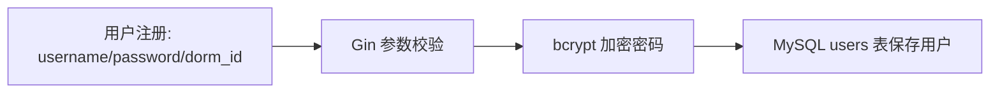
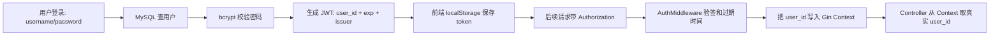

# 1、关于注册和登录

## 统一复盘格式

之后每个项目功能点都按这个格式整理：

1. **功能定位**：这个功能解决什么业务问题？
2. **项目链路**：请求从哪里来，经过哪些模块，最后落到哪里？
3. **当前实现**：项目里真实用了哪些技术、代码、数据表、中间件？
4. **技术选型五问**：
   - 目的：为什么用这个技术？
   - 对比：为什么不用其他方案？
   - 风险：这个技术会带来什么问题？
   - 应对：项目当前怎么处理？生产环境还可以怎么增强？
   - 评估：怎么证明这个技术引入后是有效的？
5. **面试追问**：面试官可能怎么追问？
6. **可背答案**：整理成 60-90 秒的面试表达。
7. **补充与纠偏**：和原始理解区分开，单独记录新增内容或修正点。

---

## 一、功能定位

注册和登录主要解决两个问题：

1. **注册**：创建用户身份，把用户信息安全地写入数据库。
2. **登录与鉴权**：用户登录成功后，后端给前端一个可验证的身份凭证。后续请求不再相信前端口头传来的 `user_id`，而是由后端中间件解析 token 后确认用户身份。

---

## 二、注册链路



### 2.1 参数校验

用户注册时的 Gin 参数校验包括多种：

1. JSON 参数默认规则，比如 `required`、`gt 0`。
2. 自定义 validator，比如用户名、密码、手机号规则。


### 2.2 用户名重复校验

用户名重复校验是 DB 做的，因为用户名是唯一的，在数据库字段使用了 `unique`。所以执行 `db.Create(user)` 时，GORM 会返回错误。错误码也是定义在 `code_error.go` 中，非常标准化。


---

## 三、登录与鉴权链路



### 3.1 登录流程

1. 用户登录直接提交表单，然后直接打到数据库。目前确实没有做额外防护。
2. 校验账号密码：根据用户名查用户，然后用 bcrypt 做密码匹配，判断用户名和密码是否和数据库一致。
3. 校验通过后生成 JWT。
4. 生成的 JWT 会发回客户端，然后存在客户端的 `localStorage` 中。之后每一次请求都会检查 `localStorage` 里的 `token` 字段是否为空，不为空就带上 token。


---

## 四、JWT 技术选型五问

### 4.1 为什么要用 JWT？（目的）

就是为了鉴别前后端分离的场景下，前端发来的表单、请求是否合法。

前端用户说我是 `user_1`，不能是口说无凭的。需要有证据证明他是后端确认过的 `user_1`，那就是前面做过的账号密码校验。用户校验成功后，后端发给用户一个包含 `user_id`、有效时间、签发人的 token。

后续的请求（一个请求一个 context）都会从 `localStorage` 里面解析出来，带着这个 token，放到 `Authorization` 字段中。后端的鉴权中间件在请求到达时解析出来 `user_id` 放到 context 中，在这次请求的剩余流程中，都可以拿来直接使用。

这样业务接口就不用相信前端传来的 `user_id`，而是统一从后端解析出的身份里取用户 ID，可以避免用户伪造别人的 ID 去查订单、改地址、下单。

### 4.2 为什么只用 JWT？（比较）

主要竞品就是 Session。

为什么不用 Session？因为 Session 是有状态的，服务器端需要保存每一位用户的登录状态（比如用户的权限、资源归属）。因为有存储需求，所以在分布式（多个服务实例）部署时，就需要解决 Session 共享的问题，比如引入 Redis Session 和粘性会话。

Redis Session 是指把用户们的 Session 状态存到 Redis 中，不能再存到服务实例中。因为可能 Nginx 把同一个用户的不同请求转发到了不同服务实例上，那么既然要访问 Redis，就要保证 Redis 的高可用性。

粘性会话是强行让 Nginx 把相同 Session 的请求转发到相同的服务实例上，改造简单，本地 Session 还能用。

但是有状态登录也是有优点的，比如服务端控制性强，可以踢用户下线，权限变更立即生效比较方便。对应的，无状态在 JWT 发出后，服务端是无法直接收回 token 的。

JWT 是无状态的。服务端不需要存每个用户的登录态，只要用密钥验签，就能判断 token 是否可信。对于我这个 Go + Vue 的前后端分离项目来说，实现简单，扩展多个后端实例时也更方便。

JWT 缓解了两方面的压力：

1. 后端实例扩容。
2. 服务器存储压力。

### 4.3 JWT 使用可能遇到哪些问题？（风险）

JWT 是无状态的，无状态有优点也有缺点。因为 JWT 是无状态的，服务端无法主动修改，服务端对 JWT 的信任依赖验签和有效期，就会导致以下问题：

1. **token 泄露**：JWT 拿到就相当于认证通过。怎么解决泄露问题？HTTPS 通过非对称加密和对称加密的手段来减少泄露。
2. **无法主动失效**：JWT 的有效期、签发人等字段是固定的，从发出的那一刻就无法改变。因为后端不存 token 状态，所以用户改密码、被封禁、退出登录后，不做处理 JWT 仍然生效。
3. **权限信息无法更改**：一般用户权限（和 `user_id` 一样是非敏感信息）会被保存到 JWT 中，所以如果对用户修改权限后，旧 JWT 可能仍然生效。
4. **密钥风险**：如果 JWT secret 泄露，攻击者可以自己伪造合法 token。

### 4.4 怎么解决问题？（应对）

1. JWT 泄露方面：使用 HTTPS 加密。
2. 主动失效方面：双 JWT（待扩展）。
3. 权限过期方面：不要放权限字段在 JWT 中。目前就是只放 `user_id`。管理员接口会再查用户记录的 `role` 字段。
4. 密钥方面：放到环境变量里面，不要硬编码。

### 4.5 怎么评估 JWT 的引入效果？（评估）

可以从以下角度验证：

1. 未登录访问受保护接口时，后端返回 401。
2. token 过期或被篡改时，后端返回 401。
3. 合法 token 可以访问用户、订单、地址、秒杀等受保护接口。
4. 业务接口不相信请求体里的 `user_id`，只从 Context 取真实用户 ID，避免越权。
5. 普通用户访问管理员接口时返回 403。
6. 鉴权逻辑集中在中间件里，新增受保护接口只要挂到 auth 路由组下。
7. 可以通过压测观察鉴权中间件是否成为接口性能瓶颈。

---

## 五、鉴权中间件

项目中共实现了两种鉴权：

1. JWT 鉴权。
2. Admin 鉴权。

### 5.1 JWT 鉴权

所有 JWT 路由都取 JWT 判断是否有效。无效则弹出登录，有效则取出字段放入 Context。


### 5.2 Admin 鉴权

所有 admin 路由都进行 admin 中间件判断。


---

## 六、面试追问与回答

### 6.1 为什么 JWT 的 payload 不放权限？

不把 `role` 放进 JWT，是因为 JWT 一旦签发，在过期前 payload 里的权限信息不会自动更新。如果用户被降权、封禁，旧 token 仍然携带旧权限。我的项目只把 `user_id` 放进 JWT，管理员接口再根据 `user_id` 查数据库里的最新 `role`，牺牲一次查询换取权限实时性。普通用户接口只需要身份识别，所以用 JWT 解析出的 `user_id` 就够了。

### 6.2 旧 token 怎么处理？怎么解决单 JWT 的无状态缺点？

单 JWT 的无状态缺点是：**服务端没法主动收回已签发 token**。

三种方法：

1. 双 Token。
2. 黑名单。
3. Version 字段。

#### 方案一：Version 字段

可以在 payload 中存入 `version` 字段，然后用户表（DB）里面存一个 `token_version`。

如果用户权限修改、被封禁、改密码，或者发生任何应该让 JWT 失效的行为，都会更新 `token_version`。之后鉴权时，就会去查这个 token 是否过期或版本是否一致。

#### 方案二：JTI 黑名单

可以选取参数 `jti`，也就是 JWT 的唯一 ID。用户退出登录时，就把这个 `jti`（JWT ID）放入 Redis，设置 TTL 为 JWT 的剩余时间。

`jti` 也是后端的 `jwt.go` 签发的，是 payload 的一个字段。用户每一次 JWT 签发，发的都是不同的 JWT、不同的 `jti`。

用户退出登录时，`jti-a` 被存入 Redis，代表 `jwt-a` 失效。用户立即重新登录时，后端发新的 JWT、新的 `jti`。这样就做到了用户的旧 JWT 失效，但是新申请的 JWT 仍然有效。

`jti` 是后端签发 JWT 时生成的 token 唯一 ID，用来区分“同一个用户的不同登录 token”。拉黑某个 `jti`，就是只让这个具体 token 失效，而不是让这个用户所有 token 都失效。

#### 方案三：双 Token 机制

Access Token 放内存。

Refresh Token 放 `HttpOnly` Cookie。

Refresh Token 服务端存 Redis。

为什么这样放？

Access Token 生命周期短，即使泄露影响时间有限。Refresh Token 生命周期长，价值更高，所以不希望被 JS 读到，放 `HttpOnly` Cookie 更合适。服务端保存 refresh token，是为了能主动吊销。

---

## 七、可背答案

我用 JWT 主要是为了解决前后端分离下的无状态鉴权。登录成功后后端签发带 `user_id` 和过期时间的 token，后续请求由中间件验签并把 `user_id` 写入 Context，业务接口不信任前端传来的 `user_id`。

相比 Session，JWT 不需要服务端维护登录态，扩展多个后端实例更简单；但它的问题是 token 泄露后过期前可用、主动失效困难、权限信息可能过期。所以我的项目里 JWT 只放 `user_id`，不放敏感信息和完整权限；管理员接口会再查数据库 `role`。

生产上会用短 access token + refresh token + Redis 黑名单或 token version 来支持退出登录、改密码、封禁后的主动失效。效果上会验证未登录、过期、篡改 token 都被拦截，伪造 `user_id` 不能越权，同时通过压测确认鉴权中间件不是性能瓶颈。

---

## 八、补充与纠偏

### 8.1 bcrypt 更准确地说是密码哈希，不是加密

密码存储里最好说“bcrypt 哈希”，不要说“bcrypt 加密”。加密通常意味着可以解密还原，密码哈希是不可逆的。

面试表达：

> 注册时不会明文存密码，而是使用 bcrypt 对密码做慢哈希后入库。bcrypt 自带 salt，并且有 cost 成本因子，比 MD5/SHA256 这种快速哈希更适合密码存储，可以提高暴力破解成本。

### 8.2 GORM 不会直接返回业务错误码

更准确的链路是：

1. `users.username` 有唯一索引。
2. `DB.Create(&user)` 触发数据库唯一约束冲突。
3. GORM 返回数据库错误。
4. Controller 或 response 层把错误映射成项目里的业务错误码，比如用户已存在。

### 8.3 HTTPS 只能降低传输过程泄露，不能解决所有 token 泄露

HTTPS 主要防止网络传输中被窃听或篡改。但如果前端存在 XSS，token 放在 `localStorage` 里仍然可能被恶意 JS 读走。

所以生产上还要考虑：

1. Access Token 设置较短有效期。
2. Refresh Token 放 `HttpOnly + Secure + SameSite` Cookie。
3. 避免 token 出现在 URL、日志、报错信息中。
4. 做 XSS 防护，比如输入输出转义、CSP 等。

### 8.4 JWT 不是“百分百信任”，而是“验签通过后信任 claims”

服务端不是无条件相信 JWT。正确流程是：

1. 校验签名。
2. 校验过期时间。
3. 可选校验 issuer、audience、jti 黑名单、token version。
4. 校验通过后，才信任 claims 里的 `user_id`。

### 8.5 双 Token 的关键取舍

普通业务请求通常只校验 Access Token，不校验 Refresh Token。Refresh Token 只在续期时使用。

如果 Refresh Token 被吊销，旧 Access Token 在剩余有效期内默认仍可能继续访问接口。到期后，它无法再刷新。

如果要求退出后立即失效 Access Token，需要额外加：

1. Access Token 的 `jti` 黑名单。
2. 或 `token_version` 校验。
3. 或把 Access Token 有效期设得很短，接受短窗口风险。

### 8.6 Bearer 前缀

标准写法是：

```http
Authorization: Bearer <access_token>
```

`Bearer` 是 Authorization header 的一种认证方案。当前项目直接传 token 也能工作，但不够标准。改造中间件时可以兼容两种格式：

1. 如果 header 以 `Bearer ` 开头，就截取后面的 token。
2. 如果没有前缀，就按旧格式解析。

