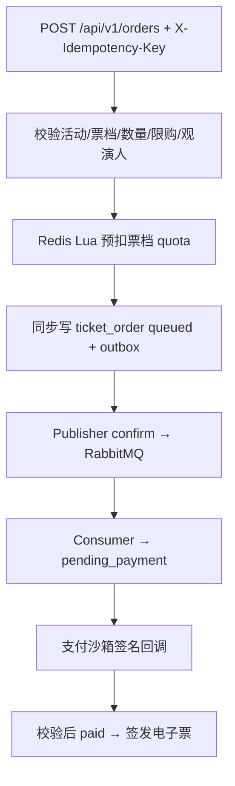

# 关于购票和抢票（Gofun 当前版本）

依据：backend/service/ticket_order_service.go、rush_sale_service.go、
ticket_order_consumer.go、ticket_order_outbox_publish.go。

## 普通购票链路



关键点：

- 创建接口返回 queued，表示已经进入异步链路，不是支付成功。
- Outbox 与订单写入同一条本地一致性边界，发布端使用 confirm；消费者按订单标识查重。
- MySQL 条件更新负责最终 quota 扣减，失败时回滚前置 Redis 预扣并按错误类型重试或确认。
- 支付回调会校验签名、provider、金额、支付单和订单状态；只有 paid 订单签发电子票。

## 限时抢票链路

```text
POST /api/v1/rush-sales/:id/execute
→ 幂等键查重
→ 校验活动时间窗、票档 quota、个人限购和限流
→ Redis Lua 原子预扣 rush quota
→ createRushOrderAfterReservation 写 queued + outbox
→ MQ consumer 确认 → pending_payment
→ 用户在收银台触发支付沙箱
```

抢票不是两步 token 流程；当前防重复依赖幂等键，防并发依赖 Lua、MySQL 条件更新、
限流和库存分桶。

## 失败与恢复

- Redis 预扣成功但建单/Outbox 失败：按订单或业务键回滚对应 quota。
- MQ 重复投递：消费者查重，不能重复创建订单或重复扣 MySQL quota。
- 支付失败：不签发电子票，订单保留待支付状态并允许重试。
- 支付超时：延时消息或扫描器条件取消订单，恢复 quota。
- 退款：先检查是否存在已核验票；外部退款与本地状态不是分布式事务，需要补偿对账。

## 当前限制

支付沙箱回调调度保存在进程内，重启不会自动恢复未发送回调。真实渠道还缺查询、对账、
退款重试和可恢复支付状态；支付回调与超时关单的并发边界也需要继续加固。

## 30 秒面试版

> Gofun 的核心挑战是高并发抢票下 Redis、MySQL、RabbitMQ 和电子票状态的一致性。入口
> 用幂等键和 Redis Lua 预扣 quota，同步写订单与 Outbox，再由 publisher confirm 投递 MQ；
> consumer 查重并用 MySQL 条件更新做最终扣减，失败按可重试/不可重试分类并回滚 Redis。
> 订单进入 pending_payment 后只接受已验签的支付沙箱回调，paid 才签发电子票；支付超时和
> 退款通过条件更新与补偿收敛。历史分桶压测只能证明指定机器和场景，不代表生产容量。
