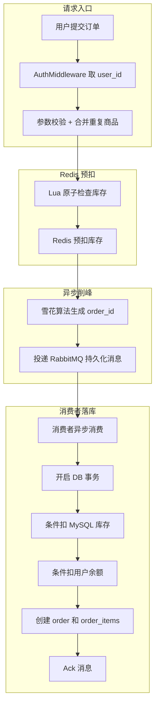

2、关于下单和秒杀

普通下单链路：

redis回滚操作的幂等怎么做？
在消息确认消费失败后，触发redis回滚操作，Rollback(msg)首先会依据order_id加锁：SETNX  stock:rollback:order:{123456789} 1 NX EX 86400。如果该订单号已经被触发了redis回滚，则加锁失败，直接返回。

重复下单和重复消费相同吗？
不同！重复下单是：前端重试（重复发送了请求）、网络抖动、用户双击。预防措施是：1、防呆设计 ，点击后显示loading避免重复点击。2、前端在每次进入带有下单按钮的结算页等都在客户端生成一个id-request，然后同时作为orders请求的内容发送给后端，后端在redis中set antiRepeateLock:{user_id}:{request} 1 nx ex 500s。这样就能避免重复下单。

重复消费呢？重复消费是指：同一条mq消息被重复执行。重复消费的原因是什么？因为当前系统使用的是手动ack，一般导致重复消费的原因：ACK丢失。
当前的防重复消费是通过业务唯一id实现的，消费者首先会取db检查业务id，如果已经存在或者有对该id未提交的事务，那么就会停止。如果发现db中没有该id，那么会开启库存、余额、落库的事务。

1、获取秒杀令牌，用户会点击“获取token”会发送token请求，后端会根据user_id、用户请求的秒杀活动id同时校验用户的购买上限、秒杀商品的库存。如果校验通过会给用户用jwt签发一个payload内容为activity、userid、timestamp的60s的token，后端同时会将这个token存到redis中同样设置ttl为60s。

2、用户成功获取令牌后才能点击购买按钮，此时发出seckilorder下单，取得user_id、活动id后，进入redis lua脚本：首先是校验购买数量是否合法、判断token是否有效（因为之前把token存到redis中了）、有效则删除redis的token保证token智能用一次、判断库存是否充足、判断用户数量是否超限，全部通过后就进行decrease进行扣除库存，increase用户购买数量。（使用lua脚本是必要的，因为秒杀的核心问题是并发下的原子性）如果把token校验，用户限购数量查询、修改，token删除和秒杀商品库存扣减使用redis自己的原子操作完成，多个请求并发时可能全部判断通过，导致超卖、重复购买的问题

3、异步落库。lua成功返回后，后端用雪花算法生成订单id，然后构造消息投递到mq，消息内包括orderid userid seckill_activity_id seckkillprice quantity。如果mq投递失败，后端会立即回滚redis秒杀库存和用户购买数/投递成功后，异步处理消息。

怎么放超卖？

1、redis lua脚本

2、db事务再次校验

怎么放重复抢购？

1、用户的抢购是需要token的 但是token是否有效是通过redis校验的，在lua脚本中，用户的秒杀请求通过后就会删除token。

2、用户限购数量也是存储在redis中的，在lua脚本中会通过用户本次请求数量和已购买数量来判断是否重复抢购。