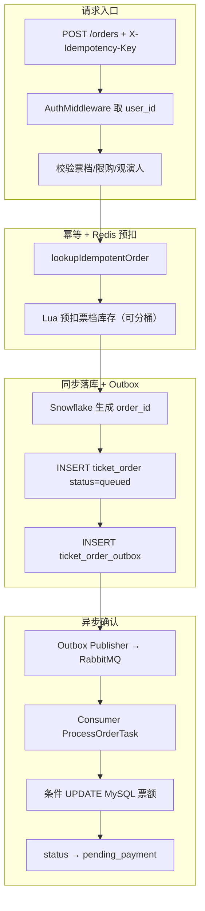

# 2、关于购票和抢票（赴场 · 当前版本）

> 依据：`ticket_order_service.go`、`rush_sale_service.go`、`ticket_order_hotpath.go`  
> 旧零食「普通下单 + 秒杀 token」链路已废弃；下文全部为票务代码。

## 普通购票链路



### 和旧零食版的关键差异

| 维度 | 旧零食 | 赴场票务 |
|------|--------|----------|
| 防重复提交 | 用户 Redis 锁 + 可选幂等键 | **仅幂等键**（Redis + DB） |
| 接口返回时订单状态 | 等 MQ 消费才落库 | **同步写 queued + outbox** |
| 库存 key | `snack:stock:{productId}` | `fuchang:ticket:stock:{tierId}:{bucket}` |
| 支付模型 | 下单占库存，支付扣余额 | 同：queued→pending_payment 后支付 |

## 限时开售（rush）链路

```text
POST /rush-sales/:id/execute（一次请求，无 token）
→ 幂等键查重
→ Lua 扣 rush 库存 + 个人限购（fuchang:rush:stock / user hash）
→ createRushOrderAfterReservation（写 queued + outbox）
→ MQ consumer 确认 → pending_payment
```

列表展示 `remaining_quota` 可读本地短缓存（≈300ms），**扣减绝不走本地缓存**。

## Redis 回滚幂等

消费失败或同步写 outbox 失败时调用 `rollbackRedisQuota` / `rollbackRushReservation`。

原则：按 **orderId 或业务键** 保证同一失败只回滚一次；分桶场景按 `bucketNo` 回补对应 key。

## 重复下单 vs 重复消费

**重复下单**（客户端层）：网络重试、双击。  
防护：`X-Idempotency-Key`（8–64 字符）+ Redis `fuchang:ticket:idem:*` + DB 唯一约束；命中直接返回原 receipt。

**重复消费**（MQ 层）：至少一次投递、Ack 丢失等。  
防护：consumer 按 `order_id` 查重；MySQL `WHERE remaining_quota >= ?` 条件 UPDATE；不可重试错误 Ack + 回滚 Redis。

## 怎么防超卖？

1. **Redis Lua 预扣** — 入口挡掉大部分无效流量。  
2. **MySQL 条件 UPDATE** — consumer 最终扣减，`RowsAffected==0` 则失败回滚 Redis。  
3. **库存分桶** — 大行热点拆成多桶，降低 InnoDB 行锁等待（压测 row_lock_waits −80%）。  
4. **补偿** — 定时把 Redis 拉回 MySQL，只下调不上调。

## 怎么防重复抢购？

1. **幂等键** — 同 key 并发只产生一单。  
2. **Lua 内个人限购** — hash 记录用户已购，与库存扣减同一脚本。  
3. **支付/超时条件更新** — `pending_payment` 才允许取消，避免与支付并发双写。

## 30 秒面试版（勿提用户锁）

> 最大挑战是高并发抢票下票额热点与 Redis/MySQL/MQ 一致性。入口用幂等键防重复、Redis Lua 预扣票额、同步写 outbox 再异步 MQ 确认；consumer 按 orderId 幂等并用条件 UPDATE 扣 MySQL 做最终兜底；失败分可重试/不可重试，不可重试回滚 Redis；支付和超时用 RowsAffected 防并发；补偿把 Redis 拉回 MySQL。1500 并发压测成功数等于库存，分桶后 MQ 追平约 11 秒。
